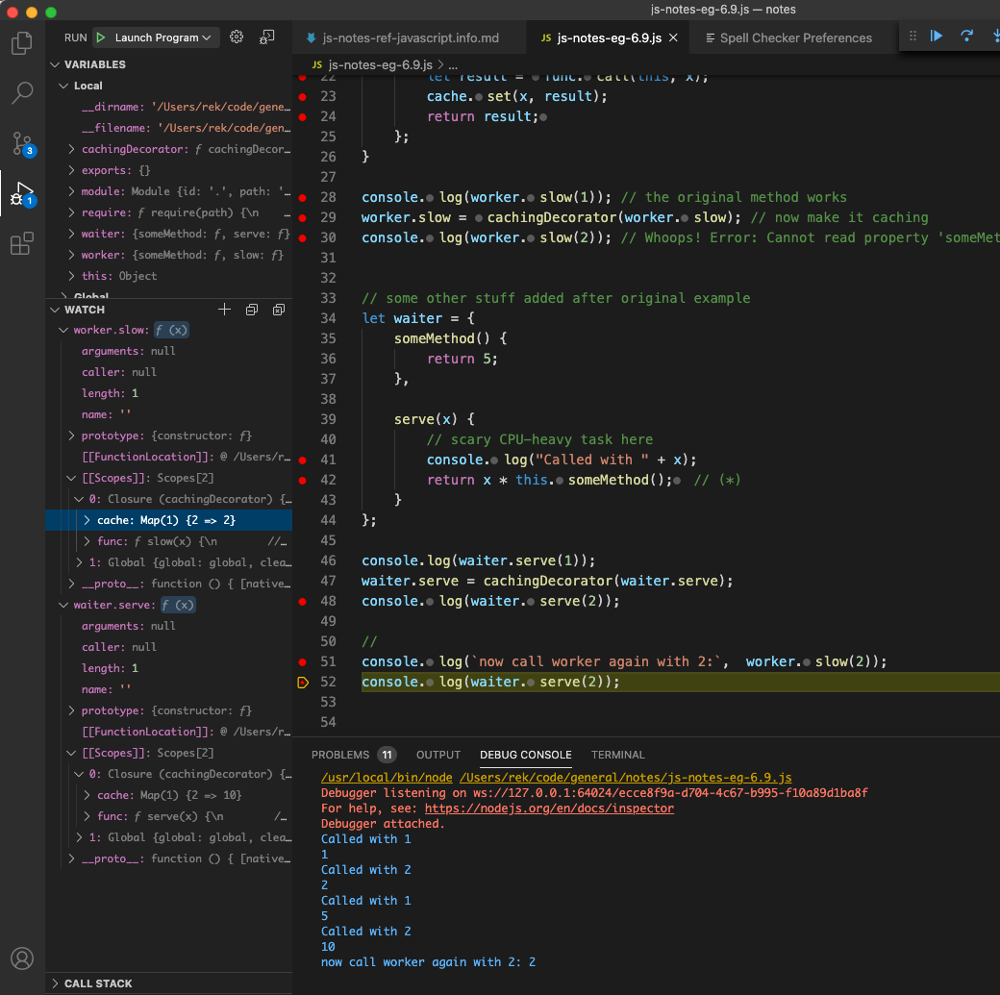

notes reading [https://javascript.info/](https://javascript.info/) (project on GitHub [here](https://github.com/javascript-tutorial/en.javascript.info)) \
The tutorial has 14 chapters for part 1 (21 Aug 2020). \
*see also, some useful materials: [MDN JS docs](https://developer.mozilla.org/en-US/docs/Web/JavaScript)*

progress: chapter 2, 6, 7, 8 finished, on chapter x <br/><br/>


- [2. JavaScript Fundamentals](#2-javascript-fundamentals)
  - [2.3 The modern mode, `"use strict"`](#23-the-modern-mode-use-strict)
  - [2.7 Type Conversions](#27-type-conversions)
  - [2.8 Basic operators, maths](#28-basic-operators-maths)
  - [2.12 Nullish coalescing operator `??`](#212-nullish-coalescing-operator-)
  - [2.13 Loops: while and for](#213-loops-while-and-for)
  - [2.15 Functions](#215-functions)
- [4. Objects: the basics](#4-objects-the-basics)
  - [4.5 Constructor, operator "new"](#45-constructor-operator-new)
- [5. Data Types](#5-data-types)
- [6. Advanced working with functions](#6-advanced-working-with-functions)
  - [6.2 Rest parameters and spread syntax](#62-rest-parameters-and-spread-syntax)
  - [6.3 Variable scope, closure](#63-variable-scope-closure)
  - [6.4 The old "var"](#64-the-old-var)
  - [6.5 Global object](#65-global-object)
  - [6.6 Function object, NFE](#66-function-object-nfe)
  - [6.7 The "new Function" syntax](#67-the-new-function-syntax)
  - [6.9 Decorators and forwarding, call/apply](#69-decorators-and-forwarding-callapply)
  - [6.10 Function binding](#610-function-binding)
  - [6.11 Arrow functions revisited](#611-arrow-functions-revisited)
- [7. Object properties configuration](#7-object-properties-configuration)
  - [7.1 Property flags and descriptors](#71-property-flags-and-descriptors)
- [8. Prototypes, inheritance](#8-prototypes-inheritance)
  - [8.1 Prototypal inheritance](#81-prototypal-inheritance)
  - [8.2 F.prototype](#82-fprototype)
  - [8.3 Native prototypes](#83-native-prototypes)
  - [8.4 Prototype methods, objects without `__proto__`](#84-prototype-methods-objects-without-__proto__)
- [9. Classes](#9-classes)
- [11. Promises, async/await](#11-promises-asyncawait)
- [13. Modules](#13-modules)


### 2. JavaScript Fundamentals
#### 2.3 The modern mode, `"use strict"`
`"use strict"` or `'use strict'`. When it is located at the top of a script, the whole script works the “modern” way.

#### 2.7 Type Conversions
* String Conversion:  `let name = true; String(name) // -> "true"`
* Numeric Conversion: `Number("   123   ")  // -> 123`
* Boolean Conversion: `Boolean("0")  // -> true`
Values that are intuitively “empty”, like `0`, an empty string, `null`, `undefined`, and `NaN`, become false. Other values become true.

#### 2.8 Basic operators, maths
* Math: Exponentiation `**`
```js 
alert( 4 ** (1/2) );  // 2 (power of 1/2 is the same as a square root)
```

* chaining assignments / use return value
```js 
let a, b, c, d = 1;
a = b = (c = d + 2);
```
#### 2.12 Nullish coalescing operator `??`
Finds a first “defined” variable from the list. `Who is the first goodie??!` Quick defaults assigning.
```js 
let firstName = null, lastName = null, nickName = "Supercoder";
alert(firstName ?? lastName ?? nickName ?? "Anonymous");  // Supercoder, show the first not-null/undefined value
```
Comparison with `||`
```js 
let height = 0;
alert(height || 100); // 100, returns the first truthy value.
alert(height ?? 100); // 0  , returns the first defined value.
```
#### 2.13 Loops: while and for
Labels for break/continue: break out from multiple nested loops at once. <br/>
Label a loop `outer` and break:
```js
outer: for (let i = 0; i < 3; i++) {
  for (let j = 0; j < 3; j++) {
    let input = prompt(`Value at coords (${i},${j})`, '');
    // if an empty string or canceled, then break out of both loops
    if (!input) break outer; // (*)
    // do something with the value...
  }
}
```
#### 2.15 Functions
Default values for parameters.
```js
function showMessage(from, text = "no text given") {
  alert( from + ": " + text );
}

showMessage("Alice"); // Alice: no text given
```
... can use a more complex expression, which will be evaluated __every time the function is called__ without the respective parameter.
### 4. Objects: the basics
#### 4.5 Constructor, operator "new"
When a function is executed with new, it does the following steps:
1. A new empty object is created and assigned to `this`.
2. The function body executes. Usually it modifies `this, adds new properties to it.
3. The value of this is returned.

Constructor mode test: `new.target` property: `undefined` or the function itself.

Return from constructors (usually not used):
* If `return` is called with an object, then the object is returned instead of `this`.
* **If `return` is called with a primitive, it’s ignored.**

### 5. Data Types

### 6. Advanced working with functions
#### 6.2 Rest parameters and spread syntax
Rest parameters ...
```js
function sumAll(...args) { // args is the name for the array
  let sum = 0;
  for (let arg of args) sum += arg;
  return sum;
}
```
**The rest parameters must be at the end.**

Spread syntax
```js
let arr = [3, 5, 1];
alert( Math.max(...arr) ); // 5 (spread turns array into a list of arguments)
```
Copy an array/object
```js
let obj = { a: 1, b: 2, c: 3 };
let objCopy = { ...obj }; // spread the object into a list of parameters
                          // then return the result in a new object
```

#### 6.3 Variable scope, closure

* js runtime can't access variables in lower level code blocks `{...}` (*except the old [var](#64-the-old-var)*);
* but can access variables/functions outside current code block;

closure
Taking #2, define an anonymous function `c` at level 2, in which (level 3) it consumes resources at level 2; return `c`. When `c` is returned to level 1 and called, it runs with (reads and updates) resources stored at level 2.

```js
function makeCounter() {
  let count = 0;
  return function() {
    return count++;
  };
}
let counter = makeCounter();

alert( counter() ); // 0
alert( counter() ); // 1
```

[Closure (wiki)](https://en.wikipedia.org/wiki/Closure_(computer_programming))
>  In programming languages, a closure, also lexical closure or function closure, is a technique for implementing lexically scoped name binding in a language with first-class functions. Operationally, a closure is a record storing a function together with an environment.

#### 6.4 The old "var"
1. “var” has no block scope;
2. “var” tolerates redeclarations;
3. “var” variables can be declared below their use

#### 6.5 Global object
* browser - `window` -> `globalThis` 
* nodejs - `global`

#### 6.6 Function object, NFE
In JavaScript, functions are objects. have properties like `name`, `length` (number of function parameters).
```js
function many(a, b, ...more) {}
alert(many.name); // many
alert(many.length); // 2
```
Named Function Expression, or NFE, is a term for Function Expressions that have a name.

#### 6.7 The "new Function" syntax
0 args to n, plain string for `functionBody`. ...created literally from a string, that is passed at run time.
```js
let func = new Function ([arg1, arg2, ...argN], functionBody);
```

Closure
```js
function getFunc() {
  let value = "test";
  let func = new Function('alert(value)');
//let func = function() { alert(value); };  // <-- compare
  return func;
}
getFunc()(); // error: value is not defined
```
because if `new Function` had access to outer variables, it would have problems with minifiers.

#### 6.9 Decorators and forwarding, call/apply

**func.call**
```js
function sayHi() { alert(this.name); }

let user = { name: "John" };
let admin = { name: "Admin" };

// use call to pass different objects as "this"
sayHi.call( user ); // John
sayHi.call( admin ); // Admin
```

**vs. func.apply**

`func.call(context, 1, 2, 3)` <==> `func.apply(context, [1, 2, 3])` \
or \
`func.call(context, ...[1, 2, 3])`


**Decorators**

read the original example: https://javascript.info/call-apply-decorators#transparent-caching \
general decorator pattern: https://github.com/kamranahmedse/design-patterns-for-humans#-decorator

**some more tweaks and stuff based on the original examples**

* `cachingDecorator` creates a closure
* when it is used to decorate a function, the function gains a scope of closure (`cachingDecorator`) which has its own `cache` (fields/properties).
*  which makes it possible to decorate different functions without cache-value-mess.



#### 6.10 Function binding
create a function based on the original, binding context/`this` and first a few arguments to it.

```js
let user = {
  firstName: "John",
  say(phrase) { alert(`${phrase}, ${this.firstName}!`); }
};

let say = user.say.bind(user);
say("Hello"); // Hello, John ("Hello" argument is passed to say)
```
The exotic bound function object returned by f.bind(...) remembers the context and arguments **only at creation time**. A function cannot be re-bound.

**Partial functions** - new function by fixing some parameters of the existing one.

#### 6.11 Arrow functions revisited
* have no “this”. If this is accessed, it is taken from the outside.
* thus arrow functions can't be used as constructors, can’t be called with `new`.
* have no “arguments”


### 7. Object properties configuration
#### 7.1 Property flags and descriptors
`writable`; `enumerable` - loopable; `configurable` - can delete value, or change the 2 previous flags.

```js
let user = { name: "John" };
// view
let descriptor = Object.getOwnPropertyDescriptor(user, 'name');
alert( JSON.stringify(descriptor, null, 2 ) );
/* property descriptor:
{
  "value": "John",
  "writable": true,
  "enumerable": true,
  "configurable": true
}
*/
// update
Object.defineProperty(user, "name", {
  writable: false
});
```

### 8. Prototypes, inheritance
#### 8.1 Prototypal inheritance
via JS objects' `[[Prototype]]` property, it's either `null` or ref to another object.

To use, `__proto__` is a historical **getter/setter** for `[[Prototype]]`, in modern JS ==> `Object.getPrototypeOf/Object.setPrototypeOf`.

`for...in` loops over both own and inherited keys:

```js
let animal = { eats: true };
let rabbit = { jumps: true, __proto__: animal };

// Object.keys only returns own keys
alert(Object.keys(rabbit)); // jumps

// for..in loops over both own and inherited keys
for(let prop in rabbit) alert(prop); // jumps, then eats

for(let prop in rabbit) {
  let isOwn = rabbit.hasOwnProperty(prop);
  if (isOwn) {
    alert(`Our: ${prop}`); // Our: jumps
  } else {
    alert(`Inherited: ${prop}`); // Inherited: eats
  }
}
```

#### 8.2 F.prototype

Setting the `"prototype"` property of a constructor function `F` to an object `a`, so that when a new object is created with `new F()`, its `[[Prototype]]` is set to `a`. *see also [#4.5 Constructor, operator "new"](#45-constructor-operator-new)*.

```js
let animal = {
  eats: true
};

function Rabbit(name) {
  this.name = name;
}

Rabbit.prototype = animal;

let rabbit = new Rabbit("White Rabbit"); //  rabbit.__proto__ == animal

alert( rabbit.eats ); // true
```
`F.prototype` here means a regular property named `"prototype"` on `F`. Setting `Rabbit.prototype = animal` literally states the following: "When a new Rabbit is created, assign its `[[Prototype]]` to `animal`".

The `"prototype"` property only has such a special effect when set on a constructor function, and invoked with `new`.

\
The **default `"prototype"`** is an object with the only property `constructor` that points back to the function itself.
```js
function Rabbit() {}
// by default:
// Rabbit.prototype = { constructor: Rabbit }

alert( Rabbit.prototype.constructor == Rabbit ); // true
```

#### 8.3 Native prototypes

**Object.prototype**
```js
let obj = {};
alert(obj.__proto__ === Object.prototype); // true
alert(obj.toString === obj.__proto__.toString); //true
alert(obj.toString === Object.prototype.toString); //true
alert(Object.prototype.__proto__); // null
```
**Borrowing from prototypes**
```js
let obj = {
  0: "Hello",
  1: "world!",
  length: 2,
};
obj.join = Array.prototype.join;
alert( obj.join(',') ); // Hello,world!
```
#### 8.4 Prototype methods, objects without `__proto__`
The `__proto__` is considered outdated and somewhat deprecated (in browser-only part of the JavaScript standard). The modern methods:

* [`Object.create(proto, [descriptors])`](www.goo) – creates an empty object with given `proto` as `[[Prototype]]` and optional property descriptors.
* `Object.getPrototypeOf(obj)` – returns the `[[Prototype]]` of `obj`.
* `Object.setPrototypeOf(obj, proto)` – sets the `[[Prototype]]` of `obj` to `proto`.

[# brief history](https://javascript.info/prototype-methods#brief-history)


### 9. Classes
### 11. Promises, async/await
### 13. Modules


\
\
\
\
some other notes

dynamic
* scripting
* closure, flexible customizable reusable code
* binding, applying
* F.prototype
* any object can be a parent, inherited 
* `new Function()` to create functions at run time - *secure? injection?...*
